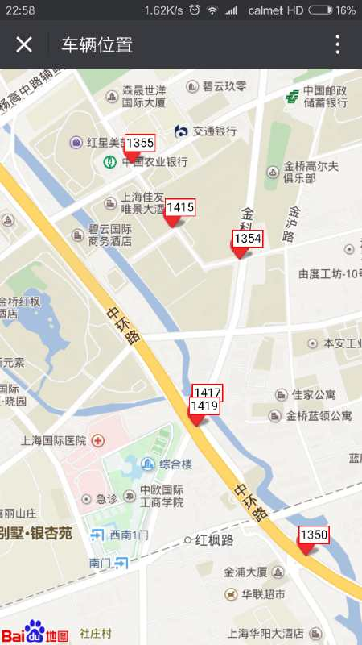

# carTrail
Arduino+GPRS.GPS.module+raspberry.PI trail the car position

server.py/updateCarPOs.py 利用树莓派做服务器接收GPS位置信息
showCarPos.py 后端准备好当天的位置数据到html静态文件中，
showCarPos.html静态文件，利用前端百度api绘出地图，通过树莓派假设的nginx静态服务器提供外部访问。
carPos.ino 为arduino控制GRPS.GPS模块对应源代码

最终效果图

